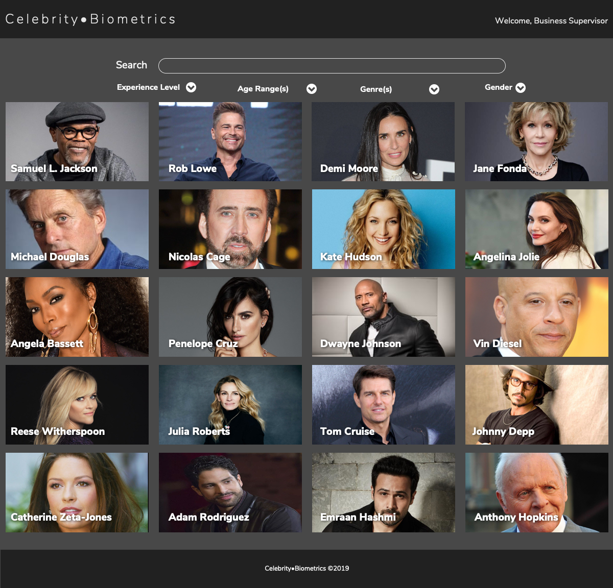
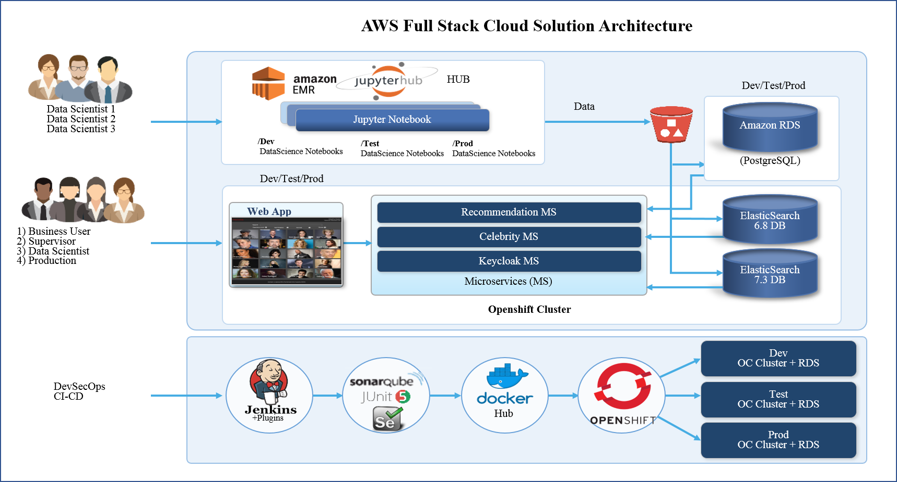
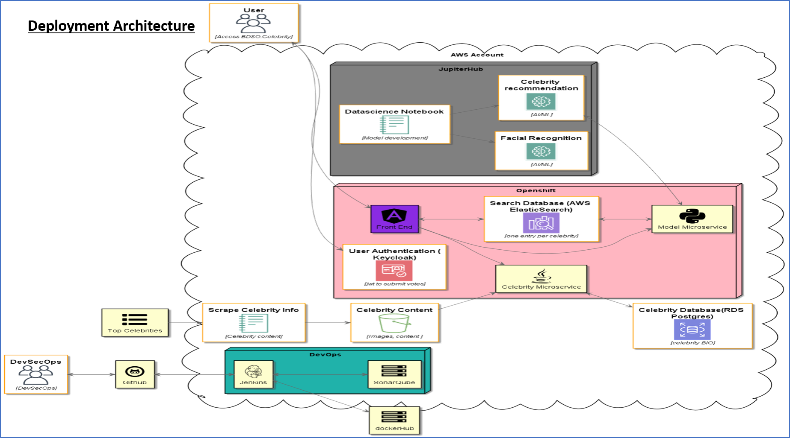
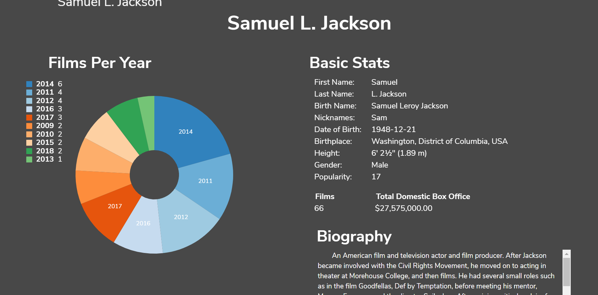
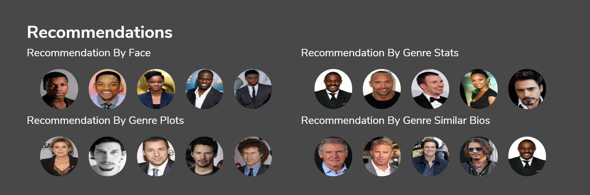
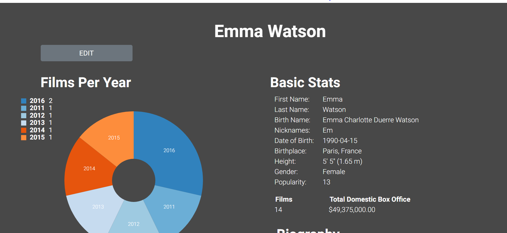
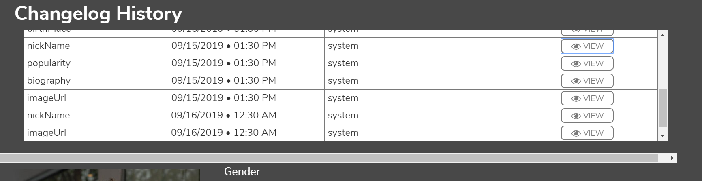
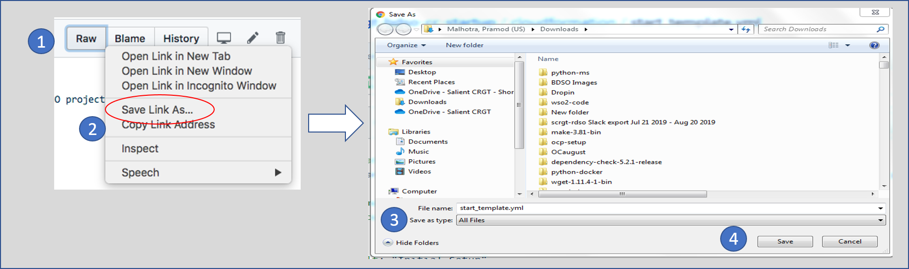
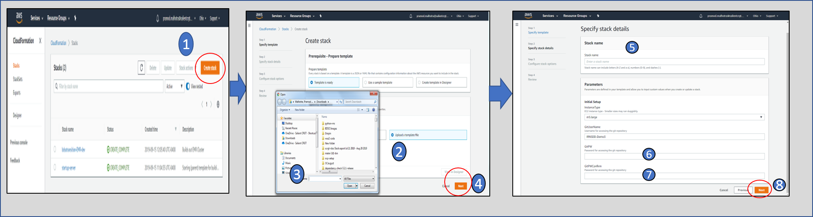
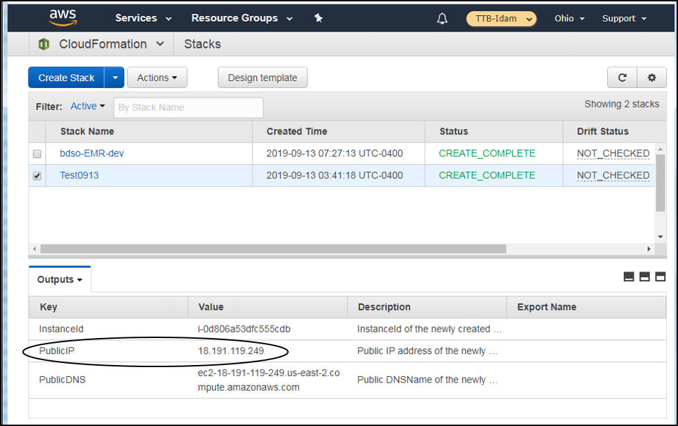

<h1>Biometrics Development, Security, and Operations (BDSO) Code Submission</h1>

<h2>Part I: Solution Description</h2>
<h6>Installation instructions are in Part 2 below</h6>  
_____________________________________________  

SalientCRGT BioCeleb Entity Corporation has implemented this solution that creates a data management and analysis environment that has stoodup all necessary infrastructure, environments, and tools to process data, use interactive notebooks, run models and visualize the output. The solution uses an interactive notebook that runs models with a micro-services architecture using a 100% automated (CI/CD) pipeline which deploys to three (3) environments (development, testing, and production) using containerized services and components in Amazon Web Services (AWS).  As required the environment and application are deployable with a **single script.**
   
Our solution scrapes 3 different open sources publicly available data sources (IMDB, MovieDB and Wikepedia) and collects celebrity profile data for 100 celebrites over a period of 10 years (06/01/2009 to 06/01/2019) hired by GlobalTier Studios. We collect informaiton like news articles, biographic details, social media etc, and create an individual profile, classification of possible roles for the movies, and linkage across multiple dimensions while keeping the lineage and time phased information.

SalientCRGT demonstration web application allows four different Personas (Product Owner, Business User, Business Supervisor and Data Scientist) to use the application.

### Hierarchy List of Core Technologies
    
    Jupyter-hub 
        -       AWS EMR Cluster
        -	Jupyter Notebook

    AWS(https://aws.amazon.com/)
        -	S3 (Storage) 
        -	System Manager Parameter Store
        -	RDS (PostgreSQL)
	    -   OpenShift Cluster
        -   EC2/IAM/ECS/VPC
        -   ElasticSearch 6.8
	    -   ElasticSearch 7.3
	    
    Languages & core libraries
        -	Python 3.6
        -	NLTK
        -	Spacy
        -	ipywidgets
        -	Java 8 
        -	Angular v7 or v8?
        -	plotly /Highcharts
    Devops
        -	GitHub/Git
        -       Jenkins/Jenkinsfile
        -	SonarQube
        -	Junit/Karma/Jasmine
        -       OWASP
        -       Selenium
        -       RestAssured
	    -       Serenity BDD
        -   Docker
	    -   CloudFormation
	    -   CloudWatch
	    -   Terraform
	    -   Keycloak IAM

	
To deliver the requirements of this challenge, several key software tools were implemented. To provide the role based access, we integrated an open source Consumer Identity and Access Management (CIAM) called Keycloak that is designed to register, login and manage users in modern applications. Keycloak improves upon modern identity management with features like secure login and registration and takes advantage of OAuth2 & API key management providing secure access across web and mobile applications. It offers its full platform with no restrictions, licenses, or barriers.  

For interactive notebooks we ended up using AWS EMR Cluster with JupyterHub. JupyterHub allows you to host multiple instances of a single-user Jupyter notebook server. Our data science engineers used  Jupyter Notebook the open-source web application to create and share documents that contain live code, equations, visualizations, and narrative text. JupyterHub provides Jupyter notebooks Service that enables data scientists and developers to quickly and easily build, train, and deploy machine learning models.  It allows importing of notebooks from a local environment to explore and visualize  data and develop innovative models. 

## Architecture Diagrams

 

 

### Consideration of the maintainability and scalability of this solution 
This solution is highly scalable from the foundation to the application layer.  The foundation is scalable inherently due to the nature of the AWS Cloud Infrastructure. Our solution is based on containerized microservices deployed using OpenShift/Kubernetes which provides the necessary scalabilty and  orchestration. Our Angular frontend application and all backend services are deployed as microservices enabling scaling based on load as programmed in OpenShift.

This solution is designed for easy maintenance.  Each tool and layer uses modern modular coding with high test coverage. Our team developed coding standards and followed them (enforced through SonarQube, Peer reviews and controled check ins to the Git Repository). These standards and unit tests will allow any competent developer to follow the code logic and, if tracing an issue, find the root cause.

Our infrastrucutre is inherently fault tolerant based as we our using AWS IaaS Services, further we use OpenShift/Kubernetes containerzation and orchestration PaaS which provides us the necessary fault tolerance needed for production applications.  As a whole the platform is designed for self-healing and auto recovery in the case of faults.

We use AWS service CloudWatch for monitoring infrastructure metrics

We practice DevSecOps and our CI-CD Pipeline incorporate automated security testing by default. We use security best practices for cloud IaaS services and use security code review and design review to further enforce high security standards. Our code goes through  static security automated testing (SSAT) and Dependency Vulnerability Testing using tools like SonarQube and OWASP via our CI/CD Pipeline. Our architects and teams focus on security reviews and also use customer provided Dynamic Security Acceptance Testing (DSAT) tools as needed.

### Team Structure

1. Scrum Master / Business Analyst (Gayatri Anand-Patel)
2. UI/UX Engineer (Jackie Granger)
3. Front End Developer-1 (Eyuel Abebe)
4. Front End Developer-2 (Tim Kelly)
5. Front End Developer 3 (Shelema Bekele)
6. Back End Engineer-1 (Ranga Balaji)
7. Back End Engineer-2 (Uchendu Offurum)
8. Back End Engineer-3 (Yonathan Molla)
9. Data Science Engineer-1 (Ray Duong)
10. Data Science Engineer-2 (Jason Boada)
11. Data Science Engineer-3 (Ezana Aemiro)
12. DevSecOps Engineer-1 (Shawn Lasitter)
13. DevSecOps Engineer-2 (Padmaja Prabhala)
14. DevSecOps Engineer-2 (Vijay Deshmukh)
15. DevSecOps Engineer-3 (Gary Morris)
16. Automation Tester-1 (Kala Shamunghan)
17. Automation Tester-2 (Kashif Gbajabiamila)
18. Technical Writer-1 (Alice Blackburn)
19. System Architect (Amit Yadav)
20. System Architect (Pramod Malhotra)

### Business Focus Use Cases
#### Case 1:
Often searching for a movie star requires knowledge of information that is not readily available. For example, a GlobalTier Business User my not know the spelling of a name. As a result they attempt a search for ‘goorge cloon’ and view the Celebrity Profile page for George Clooney. The fuzzy search feature enables a successful search.
1.	Log into BioCeleb application using the ‘business user’ login (test-user/test123) on web application URL
2.	Select a celebrity or type in “6 Feet, American, Bald” into the search bar to test the fuzzy search functionality and click search.  The search result will give you all celebrities that match the criteria
3.	Click on Samuel Jackson to view the celebrity result profile

4.	When scrolled down the profile gives you recommendations for celebrities based on Facial features, Genre plot, Genre Stats, Genre similar bios. 

#### Case 2:
BioCeleb data can be wrong and need to be edited after the automated processes are finished. In that case, a BioCeleb Business Supervisor may manually edit data. The example here is for the celebrity ‘Emma Watson’.
1.	Log into BioCeleb application using the ‘supervisor’ login (test-supervisor/test123)
2.	Locate the celebrity (Emma Watson) whose data needs to be edited.
3.	Click on the Emma Watson’s profile
4.	Click on the “Edit” button 

5.	Edit the Nickname field and Save the changes 
6.	Scroll down to the “Change Log”.  That should display the field name, change date and who made the change.

7.	Click “View “. Confirm that the change was made to the correct field.

<h2>Part 2: Installation Instructions</h2>

### Git Repositories Used are below and access has been provided to GitHub User: _IRNSDD-Demo3_
1. https://github.com/SalientCRGT/scrgt-bdso-cc-startup       # Startup  code
2. https://github.com/SalientCRGT/scrgt-bdso-cc-frontend      # frontend code
3. https://github.com/SalientCRGT/scrgt-bdso-cc-ms-celebrity  # celebrity api
4. https://github.com/SalientCRGT/scrgt-bdso-cc-datascience   # datascience models
_____________________________________________  
<h2>Instructions for Deploying the Solution in an AWS Account</h2>
*Requires AWS credentials with admin access.*

### Step 1: Download start_template.yml template file from github
- As github User **IRNSDD-Demo3**,  go to URL Link https://github.com/SalientCRGT/scrgt-bdso-cc-startup/tree/master/cloudformation/start_template.yml on your browser
- right-click on **"Raw"** data button and use option _**"Save link as..."**_
- Save file name = _**"start_template.yml"**_, choosing "Save as type" = _**All Files**_ 

### Step 2: Run CloudFormation Template on AWS Account
- On the AWS Console bring up _"CloudFormation Service"_ and choose _"Create Stack"_ or _"Create New Stack"_
- On _"Select Template"_ page use upload template to S3 using option _"Choose File"_, and select file **start_template.yml**, downloaded in previous step and hit _**Next**_ button to continue.
- On _"Specify Details"_ page enter unique _"Stack name"_, and password for GitHub user **IRNSDD-Demo3**, rest of values are defaulted. After adding Stack Name and GitHub User's password, hit _**Next**_ button.
- On _"Options"_ page make no changes and hit _**Next**_ button at bottom to continue.
- On _"Review"_ page select checkbox and acknowledge  _"I acknowledge that AWS CloudFormation might create IAM resources with custom names"_ to accept and then hit _**Create**_ button to start the creation process. This may take up to 5 mins. Once complete, the status for the stack will say "CREATE_COMPLETE"

- On _"Output"_ page After the template processing is complete, select the record and the checkbox next to the stack name you provided and at the bottom pane choose Output tab. Select the value for Public IP. This is the IP of the eC2 instance referred to as the Startup Server.

### Step 3: Connect to Startup Server (EC2 Instance) created by CloudFormation Template to kick off Single-Script for Creation of infrastructure and Demolition of infrastructure 
- Login as user _**‘ec2-user’**_ with the public IP address for Startup Server as follows: _**ssh ec2-user@PublicIP**_.  Note: no public key is necessary.  
- The password for **'ec2-user'** has been sent to you via email, please check the ec2-user password section in the email.

### Step #4: Kick off the remaining infrastructure script
- To Create Infrastructure using single-script
	- Syntax is **./infraBuild.py \<action\>**
	- Run Command  **./infraBuild.py create**
- To Destroy Infrastructure using single-script
	- Syntax is **./infraBuild.py \<action\>**
	- Run Command **./infraBuild.py destroy**                          
		
### Resulting URL locations of service and access credentials information: 
The automated scripts will display all necessary URL's and credentials on the console when finished.Please save the information 
The resulting URL's and credentials will also be stored in _**/home/ec2-user/bdso-infrastructure-assets.out**_ file on the Startup Server.

## Repository Hierarchy List: scrgt-bdso-cc-startup

    ├── Approach.md             # Approach for the project
    ├── cloudformation          # Contains template files for cloudformation 
    ├── database                # Terraform scripts to add RDS
    ├── docs	                # Documentation files (keep this if needed
    ├── img                     # directory containing graphics
    ├── jupyter                 # scripts for installing jupyter-hub for launching jupyter notebook  
    ├── models                  # directory that holds models.md with details of logic and innovation of the solution 
        ├── models.md           # Details of logic and innovation of the solution including of use of AI /ML algorithms
    ├── ocp-app                 #    
    ├── ocp-setup               #    
    ├── out/docs/arch           # graphical output from docs/architecture files
    ├── pipeline-tools          # files for creating infrastructure and pipeline tools   
    ├── .gitignore              # contains ignore files   
    ├── ReadME.md               # contains information about solution and installation, URLs and credentials
    ├── destroy.sh              # destroys the infrastructure using the terraform.tfstate
    ├── infraBuild.py           # Single-script to setup and destroy/demolish infrastructure.
    ├── Scans.pdf               # OWASP Reports for Angular, Java and Python code.  
    ├── startup.sh              # The file performs the installation of infrastructure, tools, ocp cluster and stores results of the run in a file.

     

