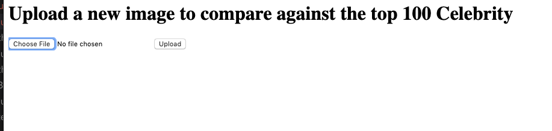
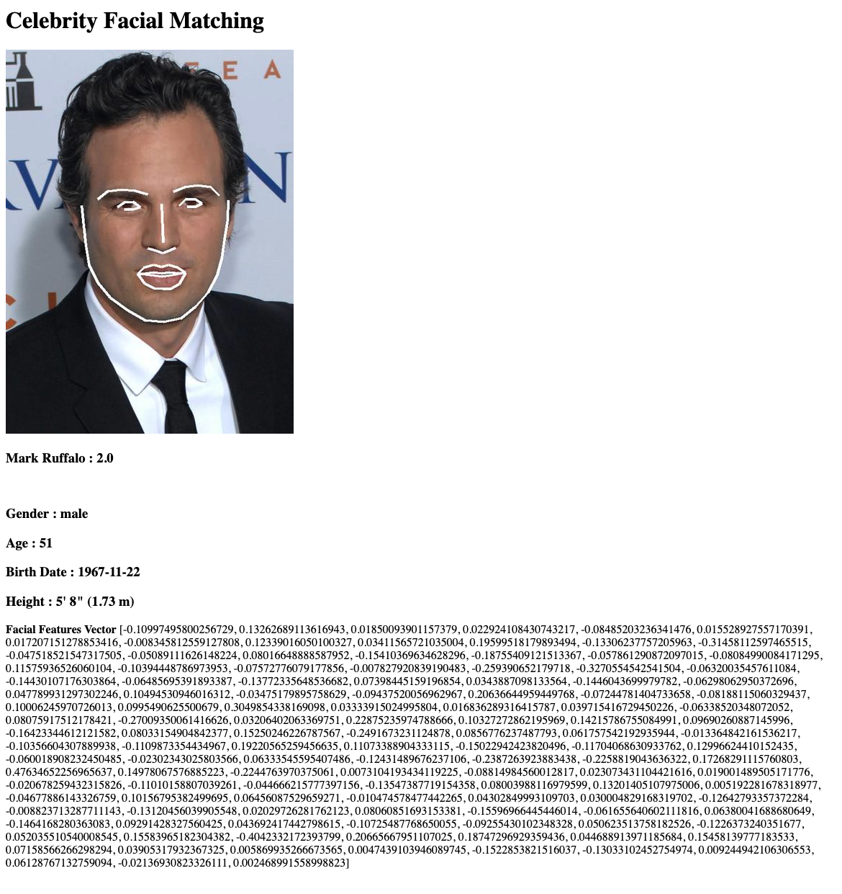
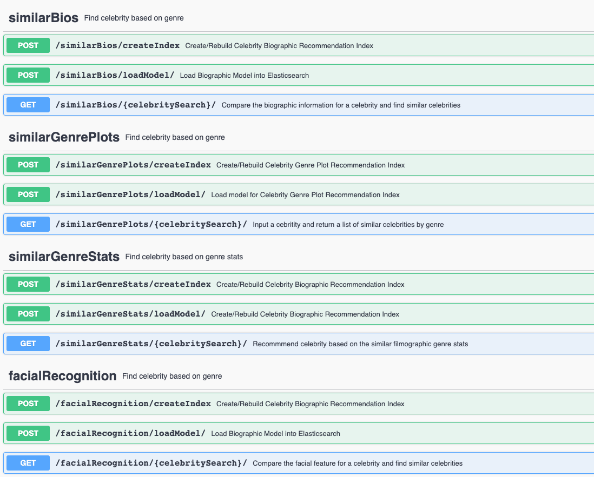

## Data Science APIs


Instruction :

### Docker Image

Change the enviornment variable for the Elastic Search Host and Port number.
```
.env

AWS_ACCESS_KEY_ID
AWS_SECRET_ACCESS_KEY
AWS_S3_BUCKET
ES_73_PORT
ES_73_HOST
```

Start Docker Container
```

docker build -t facial_recognition .

docker run -d -name facial_recognition -port 5001:5001 facial_recognition
```

### APIs

#### Facial Recognition App

```
http://localhost:5001/facedemo

App: Upload a image and find similar actors.
Display the first match with facial and biometric features.
```




#### Recommendation APIs
There are four sets of APIs for the celebrity recommendations.  Each API namespace, can bootstrap the recommendation engine, but create the index in elasticsearch and pre-loading the top 100 celebrity from the ML/AI model.

The four ML/AI Model is as 
<b>Bio Similarities</b>  
 Using the IMDB Celebrity Bio page, we ingested the celebrity biography and synopys.  The information contains a history of the movies and mentions about the celebrity.  We applied a NLP model to identify keywords and phrases that best describe the celebrity.  The keywords are then feed into ELMo: a Deep contextualized word representation to represent the semantics of the bio.The bio vectors are then feed into the recommendation engine (Elasticsearch).  Using a cosine simimlarity measurement, we measured the distance between different celebrities. Only the top celebrities are returned.

<b>Genre History Similarities</b> 
Using the filmography history of the celebrity, we identify the number of movies performed in the different movie genre.  The more time the celebrity performed in that genre we increase the score by 1.  We did not apply any weights to the numbers if the celebrity was the lead or supporting cast member.  We take the stats and normalized the scores across all the movie genres. We then compare the genre vectors to other celebrities.

<b>Movie Plots</b> 
Expanding on the model above, we take the movie plots by genre. We applied the same NLP modeling in the Bio Similarites to extract the semantic of the movie plots that the celebrity have performed in the past.  The movie plots are represented in dense vector space and loaded to the recommendation engine. For a given celebrity by a genre, you can compare how similar other celebrites performed.

<b>Facial Features</b>
Using the celebrity profile images, we identify the facial landmarks using the Dlib library and OpenFace to future expand the facial features into a 128 points vector.  The facial vectors are then used to compare similiar facial features between celebrities. 


```
http://localhost:5001/
```




