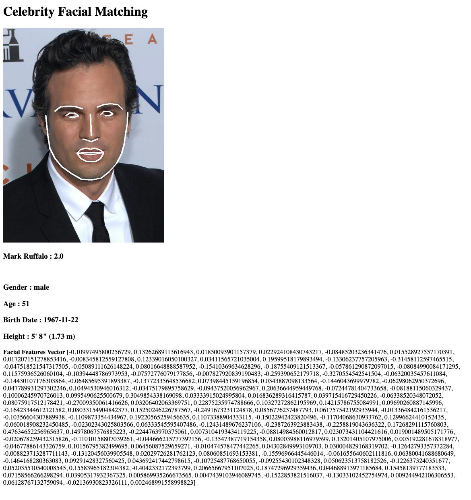

# Celebrity Facial Recognition


## User Stories
* The BioCeleb Entity Corporation has been hired to collect Biographical and Biometric information for GlobalTier Studios. The studio has agreed to hire the top 100 celebrities for a massive movie production and wants to create a celebrity profile and conduct entity resolution and analytics across the group. 

* They have collection biographic and biometric information on top 100 Celebrity from different open source databases and news feed.

* For a given celebrity, recommend alternative actors based on similar characteristics.


## Celebrity Recommendation

* Match celebrity to celebrity is similar to a dating app.  The goal is match a profile against the list of available pool of profiles based on common characteristics that have the highest possibility of making a connection.
* In the domain of a movie studio, they are not interested in becoming match makers, but finding alternative actors that have either been casted in the same roles or movie genres.
* The movie studio might want to cast for a role that have similar facial characteristics to replace another actor that have left the movie.


## Biometric Data
* Each celebrity biographical and biometric information have been collected based on publicly available data.  <b>NO</b> sensitive or PII data was obtain for this project.
* Biometric data collected
    * birthdate
    * gender 
    * height (if available)
    * profile images
    
 # Facial Recognition
 For this AI/ML demo, we will use facial recognition algorithms to match celebrity based on the facial features.  We will train the model to classifier to identify new images to a celebrity and build a recommendation engine to find similar celebrities with common facial features.
 
 ## Processing Steps
 * For a given image provided, use the [OpenCV](https://opencv.org/about/) library to identify faces in the picture.
 * Using the  [Dlib](http://dlib.net/) library, we will extract the facial landmarks below into a 68 data points for the :
    * Eyes
    * Eyebrows
    * Nose
    * Mouth
    * Jawline


 * Using the [OpenFace](https://github.com/TadasBaltrusaitis/OpenFace)  pre-trained model we measures and encode the facial landmarks into 128 measurements vector space. 
 
 *Sample facial matrix:* 
 
> `array([-6.15906976e-02,  8.68469849e-02,  1.20035715e-01,  3.41070890e-02,
        8.91930331e-03, -8.12583193e-02, -6.45000339e-02, -7.01934174e-02,
        ....
        1.28715634e-02,  2.09194496e-02, -7.01942220e-02, -6.43396229e-02,
       -5.71069866e-02, -6.46407902e-02,  1.09110467e-01, -7.56569812e-03])`

## Training Data
For the training data, the profile images collected from the themoviedb.org.  The images consists of different profiles over time in various facial expressions (happy, sad, frown), facial gears ( glasses, headbands), facial hairstyle (beard, mustache, goatee).   The more variations for the celebrity profile, will help train the classification models as new images are tested against.

Input data can be found in the data pipeline [folder](https://github.com/SalientCRGT/scrgt-bdso-cc-datascience/tree/master/datapipeline/data/person/images): 

Training folder structure:
	>> Root
		>> celebrityID
			>> << images_a_<<celebrityID>>.jpg|jpeg|png
			
## Classification 
Once we have a feature vector and label for each celebrity, we apply different classification algorithms to train the models; [Logistic Regression, KNN, SGD, SVM, Random Forrest].  Each model is evaluated against a test data set to measure it's accuracy and training time.  The top N models can be selected for the production release, using a consensus voting prediction.

## Similarity Score
To recommend other celebrity with the same facial characteristics, we apply different similarity measurement between different celebrities.   The two popular metric are the [Cosine Similarity](https://en.wikipedia.org/wiki/Cosine_similarity) and [Euclidean Distance](https://en.wikipedia.org/wiki/Euclidean_distance).  The facial features along other biometric information can be incorporated into the models to further enhance the prediction results.


## Elasticsearch facial match & recommendation
Since the facial image is transformed into dense vector, this makes it an ideally candidate to deploy our models into Elasticsearch (ES). Starting In version 7.1, ES provide the ability to store vectors inside the indices and perform various search matches that can be customized.  ES is built on a distributed architect to handle billions of documents and peform various type of searches.

To implement the index, we specify the model to hold a dense vector of 128.
```
{
  "mappings": {
    "properties": {
      "_actorID" : {
        "type" : "keyword"
      },     
      "celebrity" : {
        "type" : "keyword"
      }, 
      "facial_vector": {
        "type": "dense_vector",
        "dims": 128
      }
    }
  }
}

```
Next we define the search algorith top compare the input facial vector against the image corpus.
```
facicalVector =[-0.0865994319319725, 0.1547723263502121, 0.11647135764360428, -0.05348784476518631, -0.026111885905265808, -0.004996640142053366, 0.02010984718799591, -0.09138417989015579, 0.16325019299983978, -0.10393447428941727, 0.26392027735710144, 0.04262522608041763, -0.17962029576301575, -0.09791891276836395, 0.09553860872983932, 0.08158333599567413, -0.29037392139434814, -0.08611540496349335, -0.05405981093645096, -0.06868094205856323, -0.05936623737215996, 0.05098782852292061, 0.08535328507423401, -0.013151603750884533, -0.059518761932849884, -0.26108041405677795, -0.07175756245851517, -0.13915595412254333, 0.15117278695106506, -0.0414716862142086, -0.06382555514574051, 0.005769657902419567, -0.2461748570203781, -0.03276572376489639, -0.062235064804553986, -0.029176823794841766, 0.03860582783818245, -0.026595083996653557, 0.19672393798828125, 0.047811634838581085, -0.09344539791345596, -0.07775542885065079, -0.0040527209639549255, 0.22311992943286896, 0.21590833365917206, -0.019895289093255997, -0.04806771129369736, 0.07343978434801102, 0.01277383416891098, -0.16670356690883636, 0.07625529915094376, 0.10308811813592911, 0.20396625995635986, 0.057876359671354294, 0.004202492069453001, -0.19998204708099365, -0.03275959938764572, -0.002369481138885021, -0.08730950951576233, 0.06798733025789261, 0.09074174612760544, -0.0927027091383934, -0.020686306059360504, -0.007380591239780188, 0.33890408277511597, 0.09122084826231003, -0.08129587769508362, -0.18075791001319885, 0.10208127647638321, -0.09331383556127548, -0.0988638624548912, 0.047538258135318756, -0.1588563323020935, -0.017572728917002678, -0.26215359568595886, 0.0427873358130455, 0.25608041882514954, 0.11964087188243866, -0.198289692401886, -0.005372968502342701, -0.20604664087295532, -0.041313473135232925, -0.00883499439805746, 0.09691508114337921, -0.09412065148353577, 0.07351617515087128, -0.07343287765979767, -0.011971116065979004, 0.12895527482032776, -0.00040591973811388016, -0.11712130159139633, 0.2198733389377594, -0.06745602190494537, 0.03355204313993454, -0.009182915091514587, -0.15589208900928497, 0.01921061798930168, -0.05102435499429703, -0.08595862984657288, -0.0336931049823761, -0.0066622281447052956, -0.12268581986427307, -0.04636511579155922, 0.1837030053138733, -0.22998324036598206, 0.0762787014245987, -0.0007653213106095791, 0.011642297729849815, 0.03597094863653183, 0.06777633726596832, -0.09956732392311096, -0.06468761712312698, 0.15399740636348724, -0.2643252909183502, 0.24139092862606049, 0.1924624890089035, 0.02700689062476158, 0.10112108290195465, 0.03542455658316612, 0.11118753254413605, -0.034934964030981064, 0.0791907086968422, -0.11021479219198227, -0.06284264475107193, 0.05167575180530548, -0.06907293945550919, 0.10757213085889816, 0.093105748295784]

q={
  "query": {
    "script_score": {
      "query" : {
        "match_all" : {}
      },
      "script": {
        "source": "cosineSimilarity(params.query_vector, doc['facial_vector']) + 1.0", 
        "params": {
          "query_vector": facicalVector
        }
      }
    }
  }
}

```
## Production End-Point
Next we wrap the pipeline into a micro service that can take any input image and/or search criteria to classify new images to a celeberity or recommend similar celebrities.


